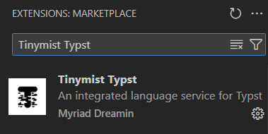

# Typst 西安电子科技大学本科毕业设计论文模板

📖 基于Typst的XIDIAN本科毕设论文模板 | 简洁高效·符合学校规范

本模板基于typst0.13,遵循《西安电子科技大学本科毕业设计撰写规范》要求，设计了一个轻量化的模板。包括论文封面和摘要后的所有内容。 封面部分不同学院可能略有不同，建议在学校给的word基础上填写后合并pdf。

## 使用方法：

### 安装Typst

1. 在vscode插件市场中安装tinymist插件，版本要求为0.13.*

2. 克隆本项目

```bash
git clone git@github.com:Hubert9982/typst_xdutemplate.git
```

### 在config.typ中配置和填写信息

```typ
#let config-dict = (
  title: ("基于SIP多媒体系统的数据会议","研究与实现"),
  class-number: [2101011],
  student-number:[2101010025],
  student-name: [张~~三],
  school-name: [通信工程学院],
  major-name: [通信工程],
  teacher-name: [李~~四],
  teacherInXDU-name:[（如无院内导师，则无需写此条）],

	ch-heading-font: ("SimHei","SimSun","SimSun"),
	en-heading-font: ("Times New Roman","Times New Roman","Times New Roman"),
  heading-fontsize: (16pt,14pt,12pt),
	ch-main-font: "SimSun",
	en-main-font: "Times New Roman",
  main-fontsize: 12pt,
  caption-fontsize: 10.5pt,
  header-fontsize: 10.5pt,
  pagenum-fontsize: 9pt,
  float-figure: auto // 图片是否浮动，如果是auto，则自动浮动，如果是none，图片在原位置
)
```

### 在main.typ中填写内容

详情内容请打开main.typ 文件查看

## Changelog

2025.5.27：修复了和modern-nju-thesis 双语参考文献不兼容的问题

2025.5.24:  5.23修改后页眉大小字号变大的问题，修复了页码超出边距的问题

2025.5.23:  摘要的页码修改为从1开始，并且修复了页眉剧中和标题居中不在一条线上的问题

2025.4.30： 更改了参考文献的字体大小和引用使用方式， 根据格式检测系统更改frontmatter的标题，修复了英文keywords只能检测到一个的问题， 目前已经能通过格式检测

2025.4.9： 删除了英文Keywords前面的缩进

2025.3.18：更新封面参数

2025.3.17: 将四级标题从目录里移除，将图片设置为默认浮动（可在config.typ 里更改）

2025.3.13: 添加了四级标题，修改了列表的缩进和有序列表默认格式，增加了引用样式. 将template.typ移动到template文件夹中，修改模板时仅需要替换template文件夹

2025.3.9： 添加了封面，整理了项目的结构

2025.3.7： 为typst0.13 进行了模板修改

## 如何更新模板

仅需将仓库中template最新文件夹替换本地的template文件夹即可

## TIPS

1. 常见问题，这里包含有一些常用的实现方法，例如三线表，子图，双语参考文献等 [常见问题 | Typst 中文社区导航](https://typst-doc-cn.github.io/guide/FAQ.html)
2. 参考文献中，doi和url尽量同时出现或者同时不出现，否则格式检测会报错

### 伪代码的解决方案

typst原生不支持伪代码，可以通过引入lovelace包来解决。

```
#import "@preview/lovelace"
#pseudocode-list[
  + do something
  + do something else
  + *while* still something to do
    + do even more
    + *if* not done yet *then*
      + wait a bit
      + resume working
    + *else*
      + go home
    + *end*
  + *end*
]
```

上面的代码是一个基于lovelace包的简单伪代码实现，其效果如下：


更详细的使用教程参考lovelace [官方网站](https://typst.app/universe/package/lovelace/)

## 已知问题

暂无

如有问题，欢迎联系QQ：1751651073
